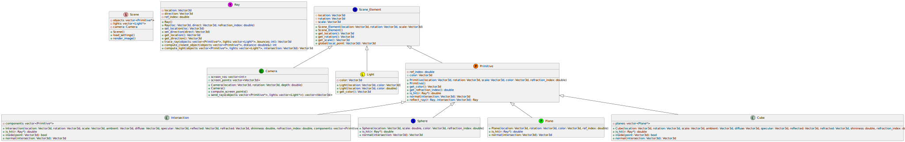

# Raytracing project 

## How to install:  
clone this repository: https://collaborating.tuhh.de/e-10/teaching/oop/exo/2023/g5/die_babos.git

Project is located at
```bash
cd project
```

#### install opencv:
```bash
sudo apt install libopencv-dev
```
1. modify settings.json file to your needs  

2. use makefile to compile and run:

#### to compile and run:
```bash
make run  
```


## About the project:

### Current State:  
  


## Documentation:

#### Use Doxygen:

##### open [index.html](doc/html/index.html) file in a browser
PATH/TO/PROJECT/doc/html/index.html

#### or   
##### install Doxywizard
```bash
sudo apt install doxygen doxygen-gui
```
##### open doxywizard
```bash
cd PATH/TO/PROJECT
doxywizard&
```
##### Select Doxyfile
File > open > PATH/TO/PROJECT/Doxyfile

##### To run:  
Run > "Run doxygen"  
##### To show:  
"Show HTML output"

#### PlantUML:

##### The [UML Graph](doc) can be found in 
PATH/TO/PROJECT/doc



